# Online Transaction Fraud Detection System - Architecture & Data Flow

This document details the end-to-end architecture, communication patterns, decision pipeline, and data flow of the Online Transaction Fraud Detection System.

---

## 1. High-Level Architecture

The system is organized into three specialized microservices decoupled via REST APIs and backed by a PostgreSQL database:

```mermaid
flowchart TD
    subgraph Ingestion["1. Ingestion Layer"]
        UserClient[Payment Gateway / Checkout Simulator]
        DashboardUI[Analyst Dashboard - React / Vite]
    end

    subgraph CoreService["2. Core Orchestration Layer (api-service)"]
        API[Spring Boot 3 API Service]
        RuleEngine[Threshold Engine: APPROVE / FLAGGED / BLOCK]
        ReviewModule[Human-in-the-Loop Review Manager]
    end

    subgraph MLService["3. Intelligence Layer (ml-service)"]
        ML[Python FastAPI Service]
        FeaturePipeline[Feature Extractor & Preprocessor]
        Classifier[Trained Classifier: LightGBM / SMOTE]
    end

    subgraph DataLayer["4. Persistence Layer"]
        Postgres[(PostgreSQL Database)]
        T_TX[(transactions)]
        T_FA[(fraud_assessments)]
        T_RC[(review_cases)]
    end

    UserClient -->|POST /api/v1/transactions| API
    DashboardUI -->|GET /api/v1/transactions| API
    DashboardUI -->|GET /api/v1/metrics| API
    DashboardUI -->|PATCH /api/v1/reviews/transactions/:id| API

    API -->|1. Forward Features\nPOST /api/v1/score| ML
    ML --> FeaturePipeline --> Classifier
    Classifier -->|2. Fraud Score [0.0 - 1.0]\n+ Risk Factors| API

    API --> RuleEngine
    RuleEngine -->|3. Persist State| Postgres
    RuleEngine -.->|If FLAGGED| ReviewModule
    ReviewModule -.->|Create Case| Postgres

    Postgres --- T_TX
    Postgres --- T_FA
    Postgres --- T_RC
```

---

## 2. Ingestion & Scoring Sequence

```mermaid
sequenceDiagram
    autonumber
    actor Client as Checkout Simulator
    participant API as api-service (Spring Boot)
    participant ML as ml-service (FastAPI)
    participant DB as PostgreSQL
    actor Analyst as Fraud Analyst (Dashboard)

    Client->>API: POST /api/v1/transactions (amount, card, device, email...)
    API->>ML: POST /api/v1/score (IEEE-CIS features)
    ML-->>API: 200 OK (fraud_probability: 0.54, risk_factors, etc.)
    
    rect rgb(30, 41, 59)
        note over API: Decision Threshold Engine<br/>prob < 0.30 -> APPROVE<br/>0.30 <= prob < 0.75 -> FLAGGED<br/>prob >= 0.75 -> BLOCK
    end

    API->>DB: INSERT transactions (status = FLAGGED)
    API->>DB: INSERT fraud_assessments (prob = 0.54, factors)
    API->>DB: INSERT review_cases (status = PENDING)
    API-->>Client: 201 Created (TransactionResponse)

    Analyst->>API: GET /api/v1/transactions?status=FLAGGED
    API->>DB: SELECT transactions WHERE status = 'FLAGGED'
    DB-->>API: rows
    API-->>Analyst: List<TransactionResponse>

    Analyst->>API: PATCH /api/v1/reviews/transactions/{id} (CONFIRMED_FRAUD)
    API->>DB: UPDATE review_cases SET review_status = 'CONFIRMED_FRAUD'
    API->>DB: UPDATE transactions SET status = 'BLOCK'
    API-->>Analyst: 200 OK (Updated Transaction)
```



---

## 3. Microservice Responsibilities

| Service | Technology | Primary Responsibilities |
|---|---|---|
| **`ml-service`** | Python 3.11+, FastAPI, scikit-learn, LightGBM, imbalanced-learn | - Exposes low-latency inference endpoint `/api/v1/score`<br/>- Preprocesses IEEE-CIS identity and transaction features<br/>- Handles extreme class imbalance (SMOTE / class weighting)<br/>- Computes model evaluation metrics (AUC-PR, precision, recall) |
| **`api-service`** | Java 21+, Spring Boot 3.3, Spring Data JPA, RestClient | - Transaction ingestion gateway and input validation<br/>- Downstream orchestration to `ml-service`<br/>- Enforces business decision threshold policies<br/>- Manages human-in-the-loop review workflow<br/>- Transaction audit logging to PostgreSQL |
| **`dashboard`** | React 18, TypeScript, Vite, Tailwind CSS | - Real-time monitoring feed of transactions and decisions<br/>- Filtering and triage for FLAGGED and BLOCKED cases<br/>- Analyst review portal to confirm fraud or dismiss false positives<br/>- Interactive performance dashboard (AUC-PR, Confusion Matrix) |
| **`database`** | PostgreSQL 15+ | - ACID storage for `transactions`, `fraud_assessments`, and `review_cases`<br/>- Indexed foreign keys and search paths |

---

## 4. Decision Threshold Engine

Because fraud detection faces asymmetric operational costs (blocking legitimate customers causes churn, while approving fraudulent ones causes chargebacks and financial loss), decision policies use three distinct zones:

1. **Auto-Approve Zone (`score < 0.30`)**:
   Transaction is immediately approved without human intervention.
2. **Review / Flagged Zone (`0.30 <= score < 0.75`)**:
   Transaction requires verification. An automated review case is populated into `review_cases` with status `PENDING` for manual analyst inspection.
3. **Auto-Block Zone (`score >= 0.75`)**:
   High confidence fraud. Transaction is immediately rejected to mitigate chargeback risk.
